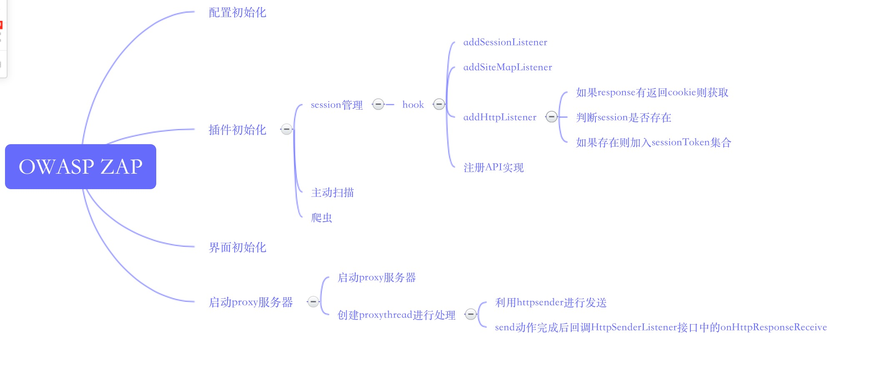

### OWASP ZAP Proxy流程分析

* content
{:toc}

OWASP ZAP Proxy是一个HTTP代理服务，采用传统socket方式进行设计，下面介绍zap proxy的实现方式。




  
  
  
 ***
  
老规矩找到入口点，入口点在Control类中的init方法

```java
	private boolean init(ControlOverrides overrides) {

		// Load extensions first as message bundles are loaded as a side effect
		loadExtension();

		// ZAP: Start proxy even if no view
	    Proxy proxy = getProxy(overrides);
	    getExtensionLoader().hookProxyListener(proxy);
	    getExtensionLoader().hookPersistentConnectionListener(proxy);
		
		if (view != null) {
		    // ZAP: Add site map listeners
		    getExtensionLoader().hookSiteMapListener(view.getSiteTreePanel());
		}
		
		model.postInit();
		return proxy.startServer();
    }
```  
  